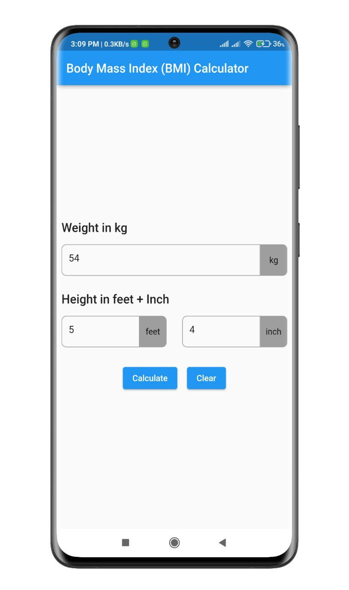
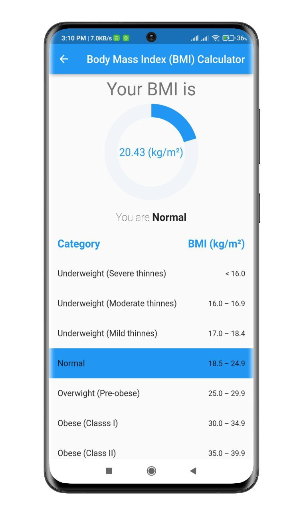

# Body Mass Index Calculator

Body Mass Index is a simple calculation using a person’s height and weight. The formula is BMI = kg/m2 where kg is a person’s weight in kilograms and m2 is their height in metres squared.

A BMI of 25.0 or more is overweight, while the healthy range is 18.5 to 24.9. BMI applies to most adults 18-65 years.


## Screenshots

<p align="center">
  
  
</p>


## Features

- Easy to use
- Live previews
- Fullscreen mode
- Cross platform


## Setup

Clone the repository

```bash
  git clone https://github.com/muradhossin/BMI_Calculator.git
```
Move to the desired folder

```bash
  cd \bmi_calculator
```
To run the app, simply write

```bash
  flutter pub get
```
```bash
  flutter run
```
## Tech Stack

**Built With:** Dart, Flutter

**State Management:** Provider


## Contributing

Contributions are always welcome!

See `contributing.md` for ways to get started.

Please adhere to this project's `code of conduct`.


## License

[MIT](https://choosealicense.com/licenses/mit/)


## Support

For support, please contact here [](https://linkedin.com/in/md-murad-hossin)

  💰 You can help me by Donating
  [](https://buymeacoffee.com/muradhossin) 
